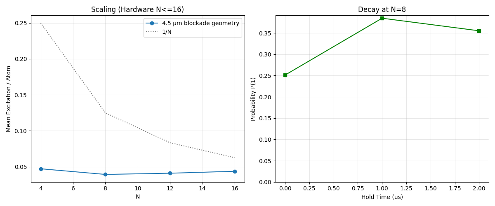

# Amazon Braket QPU Experiments

Hardware experiments run through Amazon Braket on three quantum-computing platforms:

* **QuEra Aquila** — neutral-atom processor
* **Rigetti Ankaa-3** — superconducting processor
* **IonQ Forte-1** — trapped-ion processor

This repository contains the experiment scripts, retained hardware measurements, analysis code, and validation checks.

## QuEra Aquila

The Aquila study uses programmable neutral-atom arrays with time-dependent Rabi and detuning schedules.

Hardware runs were performed at **4, 8, 12, and 16 atoms** with a **4.5 µm nearest-neighbor blockade geometry**. Additional runs include an independent 4-atom control and 8-atom hold-time experiments at **1 µs and 2 µs**. Each run used **500 shots**.

The analysis includes Rydberg excitation populations, atom-loading success, multi-excitation probability, and nearest-neighbor correlations.



Hardware results and analysis are in [`aquila/`](https://github.com/rennychung/braket-qpu-experiments/blob/main/aquila).

## Rigetti Ankaa-3

The Ankaa-3 experiments use six-qubit GHZ circuits with programmable delays.

[`ankaa3/`](https://github.com/rennychung/braket-qpu-experiments/blob/main/ankaa3) contains the hardware submission and retrieval scripts, even/odd parity analysis, statistical uncertainty estimates, and normalized-parity and exponential-decay diagnostics.

## IonQ Forte-1

The Forte-1 experiments use four-qubit GHZ and approximate W-state proxy circuits.

[`forte1/`](https://github.com/rennychung/braket-qpu-experiments/blob/main/forte1) contains the hardware script, retained measurements, and parity-visibility analysis.

## Validation

Preflight checks used before hardware execution are retained in [`validation/`](https://github.com/rennychung/braket-qpu-experiments/blob/main/validation), including:

* Aquila hardware-constraint verification
* Ankaa-3 supported-operation checks
* local OpenQASM delay validation

## Repository Structure

```text
aquila/       Aquila experiments, hardware data, figures, and analysis
ankaa3/       Ankaa-3 experiments, retrieval, and parity analysis
forte1/       Forte-1 experiments and retained results
validation/   Hardware and program-validation checks
```

## Setup

Install the required Python packages with:

```bash
pip install -r requirements.txt
```

Submitting new hardware jobs requires Amazon Braket access and locally configured AWS credentials. No credentials are included in the repository.

## Notes

Public hardware-result files have been sanitized to remove private Amazon Braket task identifiers and AWS account information while preserving the measurements and experimental metadata used in the analysis.

The public scripts are cleaned versions of the original experiment files. The experiment definitions, circuits, pulse schedules, geometries, shot counts, measurement processing, and numerical analysis were not changed.

Historical internal identifiers remain in archived records where changing them would alter the original provenance. [`CHANGES.md`](https://github.com/rennychung/braket-qpu-experiments/blob/main/CHANGES.md) records the presentation, privacy, and path changes made for the public repository.

These experiments were exploratory hardware studies, not a standardized cross-platform benchmark.
