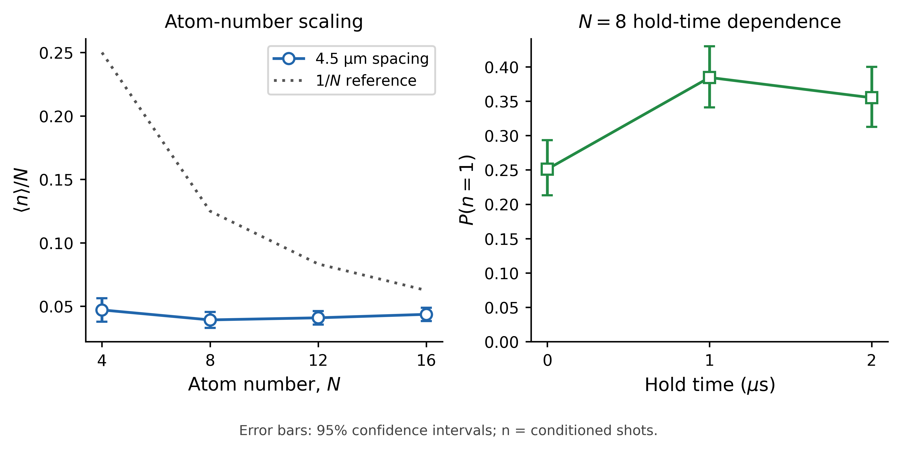

# Amazon Braket QPU Experiments

Hardware experiments run through Amazon Braket on three platforms:

* **QuEra Aquila** — neutral atoms
* **Rigetti Ankaa-3** — superconducting qubits
* **IonQ Forte-1** — trapped ions

This repository contains experiment scripts, hardware data, analysis code, and validation checks.

## QuEra Aquila

The Aquila experiments use programmable neutral-atom arrays with time-dependent Rabi and detuning schedules.

Runs were performed with **4, 8, 12, and 16 atoms** at **4.5 µm nearest-neighbor spacing**. Additional runs include a 4-atom control and 8-atom hold-time experiments at **1 µs and 2 µs**. Each run used **500 shots**.

The analysis includes excitation statistics, atom-loading success, multi-excitation probability, and nearest-neighbor correlations.



Figures are generated by
[`aquila/analyze_aquila_results.py`](aquila/analyze_aquila_results.py)
and stored in [`aquila/figures/`](aquila/figures/).

Hardware data and analysis are in [`aquila/`](aquila/).

## Rigetti Ankaa-3

The Ankaa-3 experiments use six-qubit GHZ circuits with programmable delays.

[`ankaa3/`](ankaa3/) contains submission and retrieval scripts, parity analysis, uncertainty estimates, and decay fitting.

The checked-in records include submission metadata. Completed measurement-count files are not included.

## IonQ Forte-1

The Forte-1 experiments use four-qubit GHZ and approximate W-state circuits.

[`forte1/`](forte1/) contains the hardware script, parity summaries, and parity analysis.

## Validation

[`validation/`](validation/) contains preflight checks for:

* Aquila hardware constraints
* Ankaa-3 supported operations
* OpenQASM delay handling

## Repository Structure

```text
aquila/       Aquila experiments, data, figures, and analysis
ankaa3/       Ankaa-3 experiments and analysis
forte1/       Forte-1 experiments and results
validation/   Hardware and program checks
```

## Setup

```bash
python -m pip install -r requirements-dev.txt
python -m pytest
python aquila/analyze_aquila_results.py
```

Submitting new hardware jobs requires Amazon Braket access and configured AWS credentials.

## Notes

The public repository preserves the original experiment definitions and hardware data. These are exploratory hardware studies, not a standardized cross-platform benchmark.
